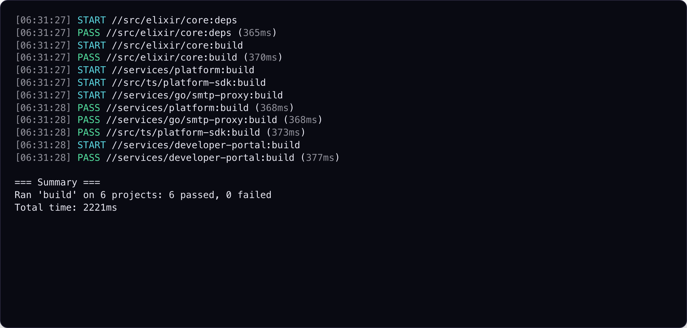
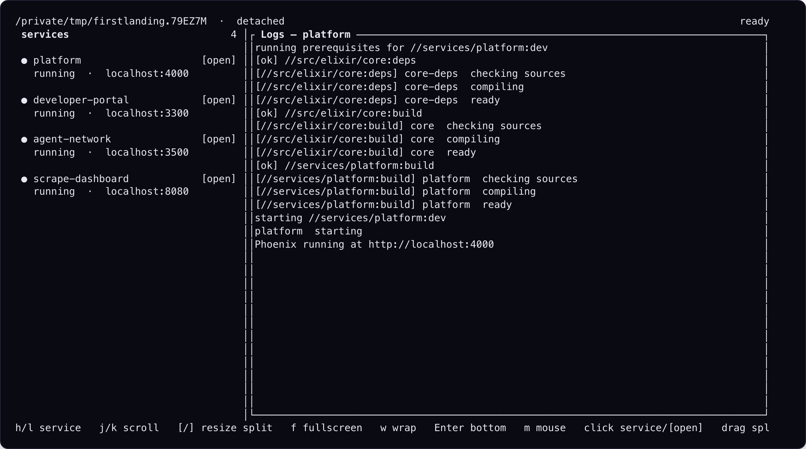

# Aster

[](https://github.com/ArchAstro/aster/actions/workflows/ci.yml)
[](https://github.com/ArchAstro/aster/releases/latest)
[](LICENSE)
[](Cargo.toml)


Aster is a build orchestrator for polyglot monorepos. It discovers projects
across languages, connects their dependencies into one graph, and runs work in
the correct order while independent targets execute in parallel.

```console
aster test --all
aster build //services/api
aster affected test --base=main
```

New to Aster? Follow the [end-to-end getting started tutorial](GETTING_STARTED.MD)
to create a workspace, connect project dependencies, build, test, cache, watch,
and run only affected projects.

[Install](#installation) · [Quick start](#quick-start) ·
[Configuration](#project-configuration) · [Contributing](CONTRIBUTING.md) ·
[Support](SUPPORT.md) · [Security](SECURITY.md)

## Why Aster

- **One graph across languages.** Rust, Node.js, Go, Python, Elixir, Java,
  Kotlin, and Ruby projects can depend on one another while each ecosystem
  keeps using its native tools.
- **Correct work, maximum concurrency.** Prerequisites run first; unrelated
  targets run together; failures stop the work that depends on them.
- **Fast local feedback.** Content-aware caching, affected-project selection,
  and watch mode avoid repeating work that cannot change the result.
- **A single development cockpit.** `aster services up` supervises long-lived
  services with focused logs, restarts, search, and collision-free ports.
- **A graph you can inspect.** `aster list`, `aster graph`, and `aster why`
  explain what Aster found and why a target will run.

### Why the name?

*Aster* comes from Ancient Greek *astḗr* (ἀστήρ), meaning “star.” The flower
took the same name from its radiating, star-shaped head. The metaphor fits a
monorepo: each project is a point in a larger constellation, dependencies draw
the lines between them, and Aster turns that graph into one coordinated build.
The word history is documented by the [Online Etymology Dictionary](https://www.etymonline.com/word/aster)
and the flower form by the [Chicago Botanic Garden](https://www.chicagobotanic.org/plant-information/plant-profiles/aster).

## Aster at work

A single command builds FirstLanding's Elixir, TypeScript, and Go projects in
dependency order while independent work runs in parallel:



For local development, `aster services up` keeps the platform and web services
in one dashboard with focused logs, service switching, search, restart, and
mouse controls:



The [screenshot fixtures](docs/screenshots/README.md) use the real Aster binary
against a synthetic, FirstLanding-shaped workspace, so these images can be
regenerated without private source code or credentials.

## Installation

### Homebrew

```console
brew install ArchAstro/tools/aster
```

### From source

Aster requires Rust 1.88 or newer.

```console
cargo install --git https://github.com/ArchAstro/aster.git --locked
```

Prebuilt archives are available from [GitHub Releases](https://github.com/ArchAstro/aster/releases)
for Linux x86-64, macOS x86-64, and macOS Apple Silicon. Windows is not
currently built or tested by the project.

### Native Linux packages

Tagged releases also include native x86-64 packages for Debian/Ubuntu, RPM-based
distributions, and Arch Linux.

For Debian and Ubuntu, add the signed Aster repository and install by package
name:

```console
sudo install -d -m 0755 /usr/share/keyrings
sudo curl -fsSL https://archastro.github.io/aster/aster-archive-keyring.gpg -o /usr/share/keyrings/aster-archive-keyring.gpg
sudo curl -fsSL https://archastro.github.io/aster/apt/aster.sources -o /etc/apt/sources.list.d/aster.sources
sudo apt update
sudo apt install aster-archive-keyring aster
```

For Fedora and other RPM-based distributions:

```console
sudo curl -fsSL https://archastro.github.io/aster/rpm/aster.repo -o /etc/yum.repos.d/aster.repo
sudo dnf install aster
```

You can also download a native package directly from the GitHub release:

```console
sudo apt install ./aster_VERSION_amd64.deb
sudo dnf install ./aster-VERSION-1.x86_64.rpm
sudo pacman -U ./aster-VERSION-1-x86_64.pkg.tar.zst
```

These packages currently target x86-64 Linux systems with glibc 2.35 or newer.

## Quick start

Run the same target across a workspace:

```console
aster test --all
aster build --all
aster lint --all
```

Select projects by address, directory, or the current directory:

```console
aster test //services/api
aster build //libs/core //libs/utils
aster test .
aster test 'services/*'
```

Dependencies run by default. Use `--no-deps` to omit them or `--dependents` to
include reverse dependencies.

Run different targets in one dependency-aware invocation:

```console
aster run //services/api:test //libs/core:build //tools/cli:lint
```

Explore what Aster discovered:

```console
aster list
aster graph
aster graph //services/api:build
aster why //services/api:test //libs/core:build
```

Use `aster --help` and `aster <command> --help` for the complete CLI reference.
`aster --skills` prints a workspace-independent Markdown usage guide covering
project selection, common targets, affected runs, watching, services, logs,
caching, and configuration. It is suitable for supplying directly to an LLM.

## Supported languages

| Language | Marker | Common detected targets |
| --- | --- | --- |
| Rust | `Cargo.toml` | deps, build, test, lint, format, clean |
| Node.js | `package.json` | deps, build, test, lint, format, clean |
| Go | `go.mod` | deps, build, test, lint, clean |
| Python | `pyproject.toml` | deps, build, test, lint, format, clean |
| Elixir | `mix.exs` | deps, build, test, lint, format, clean |
| Java | Gradle/Maven plus `.java` | deps, build, test, lint, format, clean |
| Kotlin | Gradle/Maven plus `.kt` | deps, build, test, lint, format, clean |
| Ruby | `Gemfile`, `*.gemspec` | deps, build, test, lint, format, dev, clean |

Detected targets depend on the tools and scripts present in each project.
Node.js projects use the `packageManager` field or lockfile to choose npm or
pnpm. Workspace members inherit their workspace root's package manager.
Java and Kotlin are detected independently from their build system, so one
Gradle or Maven project may report either or both languages. Kotlin DSL files
such as `build.gradle.kts` configure the build and do not by themselves make a
project Kotlin. Use `--lang java` or `--lang kotlin` across either build system.
Gradle and Maven projects prefer their checked-in wrappers and scope module
targets to the native multi-project build or reactor, which remains responsible
for ordering dependencies within that build. Pure aggregator roots and embedded
Maven integration-test fixtures are not exposed as standalone projects. In a
directory containing both Gradle and Maven configuration, Maven takes precedence
so the project has one unambiguous Aster address. A colocated `package.json`
similarly keeps the existing Node.js project rather than creating a conflicting
Gradle address.
Ruby projects use Bundler when a Gemfile is present and detect conventional gem
builds, Rake/Minitest, RSpec, Rails tests and servers, and RuboCop. A colocated
gemspec is the canonical marker for a packaged gem, while Rails and gem projects
take precedence over colocated JavaScript asset packages at the same
directory-based Aster address. Ruby config is parsed statically and is never
evaluated during discovery.

## Project configuration

Place `aster.toml` beside a project's language marker:

```toml
name = "api"
depends_on = ["//libs/core:build"]

[targets]
lint = "npm run lint"
check = { alias = "test" }

[targets.test]
command = "npm test -- {files}"
depends_on = ["//self:build"]
capabilities = ["files_list"]
files_glob = "**/*.test.ts"
exclusive_resources = ["database"]

[targets.test.cache]
enabled = true
include = ["config/**/*.json"]
exclude = ["**/*.generated.ts"]
env = ["CI"]
outputs = ["coverage/summary.json"]
```

Run `aster project init` to generate a starter file.

Target commands are parsed like a shell command line for quoting, escaping, and
leading `NAME=value` environment assignments, but they are executed directly.
Shell operators such as pipes, redirects, `&&`, substitutions, and glob
expansion are not interpreted. If shell behavior is intentional, invoke it
explicitly, for example:

```toml
[targets.generate]
command = "sh -c 'generator | formatter > src/generated.rs'"
cache = { enabled = false }
```

Only the `files_list` capability is supported. When present, `{files}` is
required to be a standalone command argument and is safely expanded into
individual path arguments. It cannot be embedded in a quoted shell script or
combined argument, used as the executable, or passed directly through a command
interpreter. Use a fixed wrapper executable for more complex handling.
Affected paths are filtered by `files_glob`.
Unknown fields, capabilities, dependencies, and invalid globs are configuration
errors.

### Cache behavior

Aster's local cache memoizes successful target executions; it does not restore
artifacts. The default cacheable target names are `deps`, `build`, `test`,
`lint`, `format`, `typecheck`, and `check`. Other targets must opt in with
`cache.enabled = true`. Set `enabled = false` to opt out.

`include`, `exclude`, and `env` extend a target's detected cache inputs.
Configured `outputs` must still exist for a cached success to be reused. Clean
targets invalidate the project's cache after succeeding.

## Affected projects

```console
aster affected test --base=main
aster affected test --base=main --dependents
aster affected test --dry-run
```

Aster compares `HEAD` with the merge base of `HEAD` and `--base`, then includes
uncommitted changes. CI must fetch enough history for the merge base to exist.

Workspace-relative files can be excluded from affected analysis in the root
`aster.toml`:

```toml
[affected]
ignore = [".agents/**", "docs/generated/**"]
```

The root-level `ignore` list separately controls project discovery.

## Watch mode

```console
aster watch //services/api:build
aster watch //services/api:dev --debounce 500ms
```

Watch mode observes the requested targets and their transitive dependencies.
Non-stream prerequisites run before a `stream = true` target starts. Relevant
source changes received during a build are preserved for the next cycle.

Configure filesystem behavior in the root `aster.toml`:

```toml
[watch]
ignore = ["coverage/**"]
suppress_paths = ["services/web/priv/static/assets/**"]
debounce_ms = 300
```

Built-in ignores cover common VCS, dependency, and build-output directories.
During the cooldown window, only configured `suppress_paths` are dropped; use
them for generated paths that would otherwise create feedback loops.

## Development services

`aster services up` runs a configured set of long-lived targets in one supervised
dashboard:

```console
aster services up
aster services up intern
aster services up --no-ui
aster services up --dry-run
```

Service stdout, stderr, and Aster lifecycle messages are also persisted to
`.aster/logs/<worktree>/<service>/logs.txt` in the workspace. Each service log
is capped at 10 MiB; Aster truncates it and continues writing when it reaches
the limit. Read one through the system pager from a terminal, or emit raw text
when piping or redirecting:

```console
aster services logs platform-backend
aster services logs platform-backend | grep ERROR
aster services logs platform-backend > platform-backend.log
```

Interactive output honors `$PAGER`, then falls back to `less` or `more`.

Clear stale or orphaned processes from development ports before starting the
stack again:

```console
aster services kill-ports --dry-run     # inspect every known worktree port
aster services kill-ports               # clean every known worktree port
aster services kill-ports api web 4011  # clean named and explicit ports
```

The command sends a graceful termination request to each listener, waits
briefly, then force-kills listeners that still hold a selected port. It targets
only processes that own the selected listening ports. An explicit numeric port
need not appear in `aster.toml` and can be cleaned from outside an Aster
workspace.

Run `scripts/test-dynamic-service-ports` for a standalone lifecycle smoke test.
It builds Aster, creates a temporary Git workspace with three dynamic services,
and reports PASS/FAIL for graceful shutdown and crash-plus-`kill-ports`
recovery. Set `ASTER_BIN` to test another binary or `ASTER_KEEP_TEMP=1` to keep
the generated workspace and logs.

Targets named `dev` remain ordinary targets (`aster dev <project selectors>`).
If a project has a target named `services`, run it explicitly with
`aster target services <project selectors>`. The same escape hatch works for
any target name that conflicts with a built-in Aster command.

Services are mappings to ordinary `stream = true` targets. Their non-stream
target dependencies are pre-start steps: Aster runs them before the service
starts and again before a dependency-triggered or manual restart. The same
transitive target graph determines which project directories are watched.

Services can be collected into named groups in the root `aster.toml`:

```toml
[dev.ports.intern-control]
env = "INTERN_CONTROL_PORT"
default = 5001

[dev.service_groups]
main = ["platform", "developer-portal", "user-portal", "agent-network"]
intern = { services = ["intern-postgres", "intern-data", "intern-ctl", "intern-gateway", "intern-fe"], control_port = "intern-control" }
```

`aster services up intern` runs that group. With no group argument, Aster runs
the `main` group plus services that do not appear in any group. When no `main`
group exists, the default remains all ungrouped services. A service may belong
to more than one group. The array form uses `[dev].control_port`. The detailed
form can set a named `control_port`, allowing multiple groups to run concurrently
without their control sockets conflicting. A detailed `main` group also supplies
the control port for `aster services up` with no group argument.

The dashboard uses scalable colored service tabs beside one focused log
stream. Use `h`/`l` or click a tab to switch services, drag the divider or use
`[`/`]` to resize, and scroll the service list independently when it exceeds
the terminal height. It also supports fullscreen logs (`f`), wrapping (`w`),
search (`/`), mouse line selection and clipboard copy (`y`), browser opening
(`o` or `[open]`), manual restart (`r`), and the `?` controls overlay. Press
`m` to disable dashboard mouse capture when native terminal selection is
preferred.

Configure the harness in the workspace-root `aster.toml`:

```toml
[dev]
port_env_files = [".env", ".env.local"]
control_port = "control"

[dev.ports.api]
allocation = "dynamic"
range = [4000, 4099]
preferred = 4000

[dev.ports.web]
env = "WEB_PORT"
default = 3000
offset_from = "api"
offset_base = 4000
saturating_offset = true

[dev.ports.control]
env = "CONTROL_PORT"
default = 5000

[dev.services.api]
target = "//services/api:dev"
port = "api"
open_path = "/health"
env_files = ["services/api/.env"]
port_env = { PORT = "api", WEB_PORT = "web" }
inherit_env = ["GOOGLE_CLOUD_MODE"]
order = 10

[dev.services.web]
target = "//services/web:dev"
port = "web"
port_env = { PORT = "web" }
env = { API_URL = "http://localhost:{ports.api}" }
order = 20
```

### Local HTTPS edges

A TLS edge is supervised like any other service, but terminates HTTPS and
routes browser traffic to other services by their named ports. Certificate
trust is an explicit setup step; `services up` never installs software or
changes the host trust store.

```toml
[dev.ports.https]
default = 8443

[dev.services.local-edge]
port = "https"
open_path = "/"
tls_proxy = { certificate_hosts = ["app.example.test", "*.local.example.test"], open_host = "app.example.test", dns_domain = "example.test", routes = [{ host = "app.example.test", upstream_port = "web" }, { host_suffix = ".local.example.test", open_host = "demo.local.example.test", upstream_port = "api" }] }
```

On macOS with fish:

```fish
brew install mkcert dnsmasq
aster services tls setup local-edge
aster services up
```

`setup` runs `mkcert -install`, writes a mode-0600 key under
`.aster/tls/local-edge/`, and verifies that `dns_domain` resolves to loopback.
Configure wildcard DNS separately (for example, dnsmasq
`address=/.example.test/127.0.0.1`). If Chrome cached an earlier DNS failure,
fully quit it and reopen it; also disable Chrome Secure DNS if it bypasses the
macOS resolver. Aster prints the same checks when DNS validation fails.

The proxy binds only to `127.0.0.1`, routes only to configured named ports,
and supports HTTP upgrades for development WebSockets/HMR. Use port 8443 when
the operating system restricts unprivileged processes from binding port 443.
Do not run the complete development stack as root.

When a TLS route points to another service's named port, that service's
dashboard `[open]` action uses the route's HTTPS hostname. Exact routes infer
it from `host`. To publish an open URL for a suffix route, configure a concrete
`open_host`; a suffix alone does not identify which tenant hostname to open.

Named ports have two allocation modes. Existing integer and detailed definitions
are static; a detailed static definition may say `allocation = "static"`
explicitly. A dynamic root uses `allocation = "dynamic"`, an inclusive `range`,
and an optional `preferred` candidate. Aster atomically claims the root and its
selected derived ports, skips ports leased by another Aster supervisor or bound
by another process, and holds the leases until the supervisor exits.
Each supervisor also writes a worktree-scoped allocation manifest. Normal
shutdown removes it after child teardown. If the supervisor crashes and leaves
an orphan listener, `services kill-ports` uses the retained manifest to resolve
dynamic names and removes it after the complete recorded bundle is free.
Explicit numeric cleanup remains available for non-Aster listeners.

`port_env_files` participate only in static named-port resolution. A service receives
only a small process baseline (`PATH`, home/user, temporary-directory, locale,
shell, and terminal variables), its own `env_files`, explicit `env`,
`ASTER_SERVICE_NAME`, and (when it has a port) `ASTER_SERVICE_PORT`; leading
target-command environment assignments take final precedence. Other ambient
variables are intentionally not inherited unless their names appear in that
service's `inherit_env` allowlist. Process environment values named by a port's
`env` field take precedence over `file_env` values from those files. When
`file_env` is omitted, the `env` names are also checked in the files. An
`offset_from` port adds the positive delta from `offset_base`, which is useful
for collision-free worktree stacks. By default, a source below the baseline is
an error; `saturating_offset = true` clamps that delta to zero.

`port_env = { PORT = "api" }` injects a resolved named port after service env
files are loaded, so stale checked-in values cannot override an allocation. A
key cannot appear in both `port_env` and `env`. `{port}` and `{ports.<name>}`
remain available in service target commands and `env` for composite values such
as URLs. Port references do not implicitly start services; groups remain the
process-selection contract. These templates are separate from the `{files}`
target capability. `open_path` controls the dashboard's browser URL.

When `control_port` is configured, Aster accepts the platform launcher's
line-delimited JSON commands on localhost: `status`, `list_services`,
`restart` (with a `service` field), `restart_all`, and `shutdown`. Aster prints
the path to a per-run token file; state-changing requests must include its
contents as the JSON `token` field. Read-only requests do not require it.

## Community

See [CONTRIBUTING.md](CONTRIBUTING.md) for development setup and pull-request
checks. Use [GitHub Discussions](https://github.com/ArchAstro/aster/discussions)
for usage questions and design conversations, and the issue forms for
reproducible bugs and feature requests; the full support policy is in
[SUPPORT.md](SUPPORT.md).

Please report vulnerabilities privately as described in
[SECURITY.md](SECURITY.md). Community expectations and project decision-making
are documented in [CODE_OF_CONDUCT.md](CODE_OF_CONDUCT.md) and
[GOVERNANCE.md](GOVERNANCE.md).

## License

[MIT](LICENSE)
