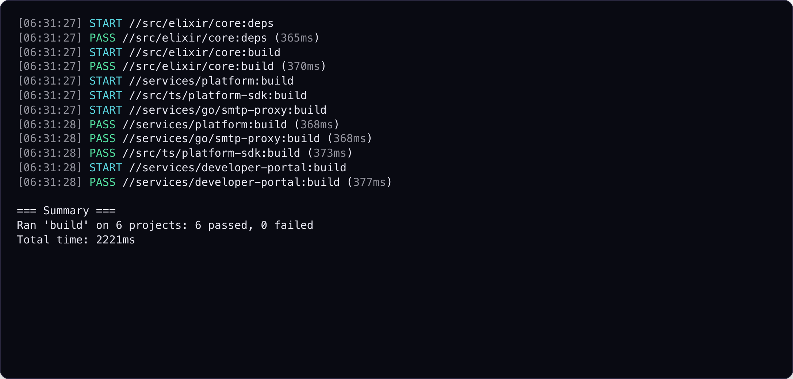
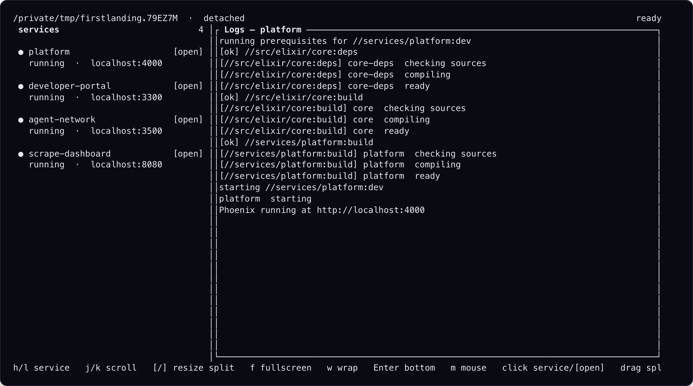

# Aster

[](https://github.com/ArchAstro/aster/actions/workflows/ci.yml)
[](https://github.com/ArchAstro/aster/releases/latest)
[](LICENSE)
[](Cargo.toml)


Aster is a build orchestrator for polyglot monorepos. It discovers projects
across languages, connects their dependencies into one graph, and runs work in
the correct order while independent targets execute in parallel.

```console
aster test --all
aster build //services/api
aster affected test --base=main
```

New to Aster? Follow the [end-to-end getting started tutorial](GETTING_STARTED.MD)
to create a workspace, connect project dependencies, build, test, cache, watch,
and run only affected projects.

[Install](#installation) · [Quick start](#quick-start) ·
[Configuration](#project-configuration) · [Contributing](CONTRIBUTING.md) ·
[Support](SUPPORT.md) · [Security](SECURITY.md)

## Why Aster

- **One graph across languages.** Rust, Node.js, Go, Python, Elixir, Java,
  Kotlin, and Ruby projects can depend on one another while each ecosystem
  keeps using its native tools.
- **Correct work, maximum concurrency.** Prerequisites run first; unrelated
  targets run together; failures stop the work that depends on them.
- **Fast local feedback.** Content-aware caching, affected-project selection,
  and watch mode avoid repeating work that cannot change the result.
- **A single development cockpit.** `aster services up` supervises long-lived
  services with focused logs, restarts, search, and collision-free ports.
- **A graph you can inspect.** `aster list`, `aster graph`, and `aster why`
  explain what Aster found and why a target will run.

### Why the name?

*Aster* comes from Ancient Greek *astḗr* (ἀστήρ), meaning “star.” The flower
took the same name from its radiating, star-shaped head. The metaphor fits a
monorepo: each project is a point in a larger constellation, dependencies draw
the lines between them, and Aster turns that graph into one coordinated build.
The word history is documented by the [Online Etymology Dictionary](https://www.etymonline.com/word/aster)
and the flower form by the [Chicago Botanic Garden](https://www.chicagobotanic.org/plant-information/plant-profiles/aster).

## Aster at work

A single command builds FirstLanding's Elixir, TypeScript, and Go projects in
dependency order while independent work runs in parallel:



For local development, `aster services up` keeps the platform and web services
in one dashboard with focused logs, service switching, search, restart, and
mouse controls:



The [screenshot fixtures](docs/screenshots/README.md) use the real Aster binary
against a synthetic, FirstLanding-shaped workspace, so these images can be
regenerated without private source code or credentials.

## Installation

### Homebrew

```console
brew install ArchAstro/tools/aster
```

### From source

Aster requires Rust 1.88 or newer.

```console
cargo install --git https://github.com/ArchAstro/aster.git --locked
```

Prebuilt archives are available from [GitHub Releases](https://github.com/ArchAstro/aster/releases)
for Linux x86-64, macOS x86-64, and macOS Apple Silicon. Windows is not
currently built or tested by the project.

### Native Linux packages

Tagged releases also include native x86-64 packages for Debian/Ubuntu, RPM-based
distributions, and Arch Linux.

For Debian and Ubuntu, add the signed Aster repository and install by package
name:

```console
sudo install -d -m 0755 /usr/share/keyrings
sudo curl -fsSL https://archastro.github.io/aster/aster-archive-keyring.gpg -o /usr/share/keyrings/aster-archive-keyring.gpg
sudo curl -fsSL https://archastro.github.io/aster/apt/aster.sources -o /etc/apt/sources.list.d/aster.sources
sudo apt update
sudo apt install aster-archive-keyring aster
```

For Fedora and other RPM-based distributions:

```console
sudo curl -fsSL https://archastro.github.io/aster/rpm/aster.repo -o /etc/yum.repos.d/aster.repo
sudo dnf install aster
```

You can also download a native package directly from the GitHub release:

```console
sudo apt install ./aster_VERSION_amd64.deb
sudo dnf install ./aster-VERSION-1.x86_64.rpm
sudo pacman -U ./aster-VERSION-1-x86_64.pkg.tar.zst
```

These packages currently target x86-64 Linux systems with glibc 2.35 or newer.

## Quick start

Run the same target across a workspace:

```console
aster test --all
aster build --all
aster lint --all
```

Select projects by address, directory, or the current directory:

```console
aster test //services/api
aster build //libs/core //libs/utils
aster test .
aster test 'services/*'
```

Dependencies run by default. Use `--no-deps` to omit them or `--dependents` to
include reverse dependencies.

Run different targets in one dependency-aware invocation:

```console
aster run //services/api:test //libs/core:build //tools/cli:lint
```

Explore what Aster discovered:

```console
aster list
aster graph
aster graph //services/api:build
aster why //services/api:test //libs/core:build
```

Use `aster --help` and `aster <command> --help` for the complete CLI reference.
`aster --skills` prints a workspace-independent Markdown usage guide covering
project selection, common targets, affected runs, watching, services, logs,
caching, and configuration. It is suitable for supplying directly to an LLM.

## Supported languages

| Language | Marker | Common detected targets |
| --- | --- | --- |
| Rust | `Cargo.toml` | deps, build, test, lint, format, clean |
| Node.js | `package.json` | deps, build, test, lint, format, clean |
| Go | `go.mod` | deps, build, test, lint, clean |
| Python | `pyproject.toml` | deps, build, test, lint, format, clean |
| Elixir | `mix.exs` | deps, build, test, lint, format, clean |
| Java | Gradle/Maven plus `.java` | deps, build, test, lint, format, clean |
| Kotlin | Gradle/Maven plus `.kt` | deps, build, test, lint, format, clean |
| Ruby | `Gemfile`, `*.gemspec` | deps, build, test, lint, format, dev, clean |

Detected targets depend on the tools and scripts present in each project.
Node.js projects use the `packageManager` field or lockfile to choose npm or
pnpm. Workspace members inherit their workspace root's package manager.
Java and Kotlin are detected independently from their build system, so one
Gradle or Maven project may report either or both languages. Kotlin DSL files
such as `build.gradle.kts` configure the build and do not by themselves make a
project Kotlin. Use `--lang java` or `--lang kotlin` across either build system.
Gradle and Maven projects prefer their checked-in wrappers and scope module
targets to the native multi-project build or reactor, which remains responsible
for ordering dependencies within that build. Pure aggregator roots and embedded
Maven integration-test fixtures are not exposed as standalone projects. In a
directory containing both Gradle and Maven configuration, Maven takes precedence
so the project has one unambiguous Aster address. A colocated `package.json`
similarly keeps the existing Node.js project rather than creating a conflicting
Gradle address.
Ruby projects use Bundler when a Gemfile is present and detect conventional gem
builds, Rake/Minitest, RSpec, Rails tests and servers, and RuboCop. A colocated
gemspec is the canonical marker for a packaged gem, while Rails and gem projects
take precedence over colocated JavaScript asset packages at the same
directory-based Aster address. Ruby config is parsed statically and is never
evaluated during discovery.

## Project configuration

Place `aster.toml` beside a project's language marker:

```toml
name = "api"
depends_on = ["//libs/core:build"]

[targets]
lint = "npm run lint"
check = { alias = "test" }

[targets.test]
command = "npm test -- {files}"
depends_on = ["//self:build"]
capabilities = ["files_list"]
files_glob = "**/*.test.ts"
exclusive_resources = ["database"]

[targets.test.cache]
enabled = true
include = ["config/**/*.json"]
exclude = ["**/*.generated.ts"]
env = ["CI"]
outputs = ["coverage/summary.json"]
```

Run `aster project init` to generate a starter file.

Target commands are parsed like a shell command line for quoting, escaping, and
leading `NAME=value` environment assignments, but they are executed directly.
Shell operators such as pipes, redirects, `&&`, substitutions, and glob
expansion are not interpreted.

Because `a && b` would run `a` with `&&`, `b` and b's arguments as extra
arguments, Aster refuses to load a target command that contains an unquoted
`|`, `&`, `;`, `<` or `>` (for example `&&`, `||`, `|`, `;`, `&`, `>`, `>>`,
`<`, `2>`, `2>&1`, `2>/dev/null`), an unquoted `$(…)` or backtick
substitution, or an unquoted line break between two words in a multi-line
command (a shell would start a second command there; Aster would pass the next
line as arguments). Leading and trailing line breaks and `\` line
continuations are fine. The error names the target, its `aster.toml`, and the word.
Every command that reads configuration fails, including `aster list` and
`aster graph`. Operators inside quotes or escaped with a backslash are literal
arguments and are accepted, so `grep '|' notes.txt` is fine.

To run several steps, either split them into targets joined with `depends_on`,
which gives each step its own log and cache entry, or invoke a shell
explicitly:

```toml
[targets.generate]
command = "sh -c 'generator | formatter > src/generated.rs'"
cache = { enabled = false }

[targets.e2e]
command = "mix test test/e2e_test.exs"
depends_on = ["//self:format-check"]

[targets.format-check]
command = "mix format --check-formatted test/e2e_test.exs"
```

Captured targets receive a closed stdin, so tools that prompt on a TTY fail
instead of hanging behind Aster's progress UI. Streaming targets
(`stream = true`, or `aster <target> --stream`) inherit the caller's terminal.

Only the `files_list` capability is supported. When present, `{files}` is
required to be a standalone command argument and is safely expanded into
individual path arguments. It cannot be embedded in a quoted shell script or
combined argument, used as the executable, or passed directly through a command
interpreter. Use a fixed wrapper executable for more complex handling.
Affected paths are filtered by `files_glob`.
Unknown fields, capabilities, dependencies, and invalid globs are configuration
errors.

### Cache behavior

Aster's local cache memoizes successful target executions; it does not restore
artifacts. The default cacheable target names are `deps`, `build`, `test`,
`lint`, `format`, `typecheck`, and `check`. Other targets must opt in with
`cache.enabled = true`. Set `enabled = false` to opt out.

`include`, `exclude`, and `env` extend a target's detected cache inputs.
Configured `outputs` must still exist for a cached success to be reused. Clean
targets invalidate the project's cache after succeeding.

## Affected projects

```console
aster affected test --base=main
aster affected test --base=main --dependents
aster affected test --base=main --related
aster affected test --dry-run
```

Aster compares `HEAD` with the merge base of `HEAD` and `--base`, then includes
uncommitted changes. CI must fetch enough history for the merge base to exist.

### Running only the affected files

```console
aster affected test --base=main --only-affected-files
aster affected test-ci --base=main --dependents --only-affected-files --dry-run
```

`--only-affected-files` narrows targets that declare the `files_list`
capability to each project's changed files. The requested target is narrowed,
and so is every target of the same project that it depends on, so a wrapper
such as `test-ci = { command = "true", depends_on = ["//self:test"] }` narrows
its `test` prerequisite. A `{files}` placeholder expands to the changed files
(after `files_glob`); otherwise the language plugin rewrites the command.

- A requested target with no relevant changed files is skipped; a narrowed
  prerequisite with none is reported as skipped while its wrapper still runs.
  A prerequisite whose plugin declines to narrow it runs in full.
- A project with no changed files of its own, selected only through
  `--dependents`, runs its targets in full (`{files}` expands to nothing).
  So does a project whose dependency also changed, with or without
  `--dependents`. Its own file list does not describe the change.
- `--dry-run` prints the chosen commands and the reasoning under each target;
  `--json` adds them as `commands` and `selection`.

Rust test targets (the detected `test` target, or any target whose command is
`cargo test …` and declares `files_list`) run only the tests related to the
change, the way `vitest related` follows importers:

- Aster walks each crate target from its root through `mod` declarations and
  builds a module graph from `crate::`, `super::`, `self::`, `use` aliases,
  glob imports and `macro_rules!` invocations. The related modules are the
  changed modules plus every module that transitively references one. A
  changed module that implements another module's type also marks that
  module changed.
- Library unit tests run filtered to the related module paths
  (`cargo test -p <crate> --lib -- a:: b::`). Tests in the crate root file
  run by exact name whenever any module is related. Integration tests,
  benches and examples run when they changed or reference a related module
  through the crate name; tests that run a binary (`CARGO_BIN_EXE_*`,
  assert_cmd's `cargo_bin`, escargot) run when any binary is related.
  Doctests all run when any module is related, unless the command uses
  `--all-targets`, which excludes them.
- A non-Rust file maps to the sources whose string literals name it as a
  path (`include_str!("../fixtures/x.json")`, `"port/index.toml"`,
  `dir.join("fixtures")`). A file no source names runs the original command.
- Other workspace members that changed, or that depend on a changed member
  through a path dependency, run in full with `-p`.
- `Cargo.toml`, `Cargo.lock`, toolchain files, `.cargo/config*`, the build
  script, the library root and `.rs` files outside every target run the
  original command. So do commands that already pick test targets or filters,
  changes that relate most of the library, and any change that maps to no
  test. With files changed, the target is never skipped.

The analysis is textual. It over-approximates: libtest filters match
substrings, module granularity selects every test in a related module, and
any string that names a file by path counts as a use. It can miss
dependencies that never appear as a path:

- Trait use through generics only. A module that calls `T::method()` on a
  generic `T: Trait` is related to the trait's module but not to a module
  that only implements the trait for a concrete type the caller never names.
  Blanket impls (`impl<T: Bound> Trait for T`) and impls for imported types
  do mark the trait or type module changed.
- Files reached at run time without naming them: directory walks from a
  parent directory, or names built with `format!`.
- Code generated by procedural macros or `include!`d from files outside the
  module tree.

### Running only the tests a change reaches

```console
aster affected test --base=main --related
aster affected test-ci --base=main --related --dry-run
aster affected build --base=main --related
```

`--related` selects at the level of functions, types and modules instead of
projects, and needs no `files_list` capability, `{files}` placeholder or
wrapper script. Aster parses every Elixir, TypeScript/JavaScript, Go and
Python file in the workspace with tree-sitter, maps the diff's hunks onto the
definitions they touch, and follows references from those definitions to the
tests that reach them, across project boundaries.

- **Test commands run narrowed.** `mix test`, Vitest, Jest, Mocha,
  `bun test`, `node --test`, `go test` and `pytest` are recognised in the
  requested target and in the same-project targets it depends on, whether
  run directly (`pnpm exec vitest run`) or through a package script that is
  only the runner. Elixir, JavaScript and Python run the selected test
  files; Go runs the selected packages with `-run '^(TestA|TestB)$'`. A
  command that already lists test files keeps the ones selected. A
  `{files}` placeholder receives the selected test files.
- **Shard and wrapper projects follow the project whose tests they run.**
  A shell one-liner that ends in a test command is narrowed in place, in
  the directory it changes into:

  ```toml
  # core-test-shard-1/aster.toml
  depends_on = ["//core"]

  [targets.test-ci]
  command = "bash -c 'cd ../core && MIX_TEST_PARTITION=1 exec mix test --partitions 2'"
  ```

  runs `… exec mix test --partitions 2 test/a_test.exs test/b_test.exs`
  with the tests selected in `//core`, so each shard takes its slice of the
  selection; `vitest --shard=1/2` works the same way. Everything before the
  final command is kept, which must be a plain command after an optional
  `cd <dir> &&`. Test targets the requested target depends on in other
  projects are narrowed too, each to its own project's selection, so a
  `command = "true"` wrapper over `//core:smoke` runs only the smoke tests
  that reach the change. A shard is skipped when none do, runs as written
  when the sharded project runs in full, and runs in full when its own
  files change.
- **Projects the change does not reach are skipped.** `--related` replaces
  `--dependents`: a dependent runs only when one of its definitions refers
  to something that changed, and then only the tests that do. For targets
  that are not test commands (`build`, `lint`), the project runs as written
  when the change reaches it and is skipped otherwise.
- **Comments, documentation and blank lines select nothing.**
- `--dry-run` prints, under each target, the narrowed command and the
  reference chain from each selected test file back to the changed line.

How a change is followed:

- A changed line inside a function, method, type, constant or test marks
  that definition. A changed import or `alias` line marks the definitions
  that use what it brings in. Any other line outside a definition (module
  attributes, `use`, top-level statements, side-effect imports) marks the
  whole file. Removed lines are read against the old file, so deleting a
  function selects the tests that still call it.
- A definition is affected when it mentions an affected name and uses the
  file that defines it: an import binding (re-exports and `tsconfig` paths
  followed), an Elixir module name after `alias`, a Go package qualifier, a
  Python import. `conftest.py` applies to the tests beneath it.
- In Elixir a call names its module, so `Orders.changeset/2` and
  `Users.changeset/2` are told apart: a definition refers to a changed
  function when it calls it through that module, calls it unqualified from
  the same file or a file that imports it, or holds its name as an atom
  (`apply/3`, `{Module, :function, args}`). A module that only appears in a
  function head's parameter patterns is matched against, not used.
- A route declaration (a module-level call given a path and a module, such
  as `get "/orders/:id", OrderController, :show`, nested in
  `scope "/api" do … end`) is reached by request, not by name. When its
  controller is affected, the definitions that hold a matching path literal
  are affected: `"/api/orders/#{id}"` and `~p"/api/orders/#{id}"` match, and
  so does a shorter base such as `"/api/orders"` that code may extend. If no
  code names a route's path, everything that goes through the router is
  affected instead.
- Methods, and functions of an Elixir `defimpl`, are reached through a
  value, so their callers need not import their file. They are matched by
  name, against member accesses (`value.name`) in the changed project and
  the projects downstream of it, with these exceptions:
  - A member of a literal, of a built-in global (`Promise.resolve`), or of
    something imported from outside the workspace (`path.join`) is not a
    method of anything the workspace declares.
  - In Go, `pkg.Name` is that package's `Name` and nothing else, and a
    variable the function declares with a struct type of its own package
    (`w *Worker`, `w := Worker{}`) calls that type's methods or those of the
    types it embeds.
  - `this.name` and `self.name` call the enclosing class's method, or one
    from a class it extends or that extends it. A base class that cannot be
    named (a mixin call) leaves the call open.
- In Go, TypeScript, JavaScript, Python and Rust, code runs only once
  something imports its file (in Rust: once a module refers to another). A test is therefore selected only when every definition
  on some chain from the change to the test is in a file the test's own
  imports lead to. A test whose imports cannot all be followed (a computed
  `import(name)`, an import of workspace code that resolves to no file) is
  taken to load anything. This does not apply to Elixir, where the whole
  application is loaded.
- Rust is read with its types:
  - Tests written beside the code they test (`#[cfg(test)] mod tests`) are
    test code though their file is not a test file. A selected test runs by
    its full path with `--exact`; a file selected as a whole, and tests a
    macro defines, run by their module's path. Doctests are not analysed
    and run whenever the original command would run them.
  - `value.name(…)` is a method call; `value.name` reads a field and calls
    nothing. `Type::name` and `Self::name` are that type's.
  - A value's type is taken from where it is written: a parameter, a
    `let` with a type, a struct field, a struct literal, or the declared
    return type of the call that made it (`let s = Arc::new(Store::new())`
    is a `Store`). A method call on such a value reaches only that type's
    methods and those of the traits it implements; a type from outside the
    workspace has none.
  - Where the type is not written, the call is matched by name, but only
    from definitions that could hold such a value: the method's type, or
    the trait it is called through, must be reachable from the types the
    caller mentions and the signatures of what it calls.
  - A method of a trait the workspace does not declare (`Display::fmt`,
    `Drop::drop`, `From::from`) is called by formatting, operators and
    conversions that name nothing. A change to one reaches every
    definition that uses the type's file.
  - A `macro_rules!` macro is found by its name wherever it is used.
  - A test that runs the package's binary (`CARGO_BIN_EXE_*`, `assert_cmd`)
    runs for any change to the package's sources.
  - `Cargo.toml`, `Cargo.lock`, `build.rs`, the toolchain file and
    `.cargo/` configuration run the project in full.
- A file the test runner loads before every test (one a `vitest.*`,
  `jest.config.*` or `playwright.config.*` file names, such as
  `setupFiles`) is no test's import. A change that reaches one runs the
  project in full.
- A definition nothing names is assumed to be called another way: a
  callback (`handle_call`, `mount`, anything marked `@impl`), a macro, a
  route. It affects every definition that uses its file.
- Elixir code that lists modules at run time
  (`:application.get_key(app, :modules)`, `Application.spec(app, :modules)`,
  `:code.all_loaded()`) can call into any of them, so it is affected by
  every source change in its own project and in the projects that one
  depends on.
- A file that is not source maps to the definitions whose string literals
  name it (by path from anywhere, by bare file name within its own
  project), to the Go declaration that embeds it (`//go:embed`), to the Go
  tests beside its `testdata/`, or to the test that owns its
  `__snapshots__` file. Prose (`.md`, `.txt`, …) that nothing names selects
  nothing. A source file read as data by code in another language is found
  the same way.
- A source file is also data to a test in its own language that names its
  path without loading it (`readFileSync("../money/src/format.ts")`): any
  change to the file, a comment included, affects the test. The path is
  read from the workspace root or the test's project root, or from the
  test's directory when it is written relative. What `import`, `require`
  and a module mock name is loaded, and followed by reference as before.
- A directory a test names by path the same way maps every file beneath it
  to the test, documents (`.md`, `.rst`, …) excepted, unless the directory
  holds a whole project. The project that owns such a file still runs in
  full when none of its own code names the file.
- Both rules read paths in tests only: a test runs in the workspace, and
  other code names paths where it is deployed.
- Tests in projects that never declared a dependency on the changed project
  are found too, when they refer to what changed. Such a project runs only
  those tests.

Where the source graph cannot see, Aster runs more:

- Manifests, lockfiles and tool configuration (`package.json`,
  `tsconfig*.json`, `vitest.config.*`, `mix.exs`, `config/*.exs`,
  `test/test_helper.exs`, `go.mod`, `pyproject.toml`, `aster.toml`, …) run
  their project in full, and every project downstream of it. A
  workspace-level lockfile does the same for every project beneath it.
- A project runs in full when a non-source file nothing names changed, when
  a changed source file reaches no test at all, or when the project imports
  Python modules by computed name.
- Inside the set `--dependents` would select, a project runs in full when
  it depends on an affected project in another language, on one Aster does
  not analyse (Ruby, JVM), or on one it never imports from: such a
  dependency is on a built artifact or a binary, which the source graph
  cannot follow. A project that says which of its sources
  use such a dependency runs only those and the tests that reach them (see
  below).
- A dependency in another language is followed by source after all when
  every test of the dependent is in that language and builds on the
  dependency's code: an Elixir test kept in a project marked by a
  `package.json`, say, and run from the dependency's directory. The
  project then runs only when the change reaches one of its tests. A test
  in a second language, a `[consumes]` entry, or a path into the dependency
  means it is also used some other way, and the rule above applies.
- A project's runner cannot name a test in another language. When one is
  selected in a project the change's dependents include, the project's
  targets run as written.
- A command Aster cannot read as a test runner runs as written: a script
  file, a one-liner whose last command is piped, uses a variable or sits in
  a block, a command that lists test files outside its project, or a
  selection too long for one command line.

#### Seeing the source graph of a change

`aster graph --source` prints what `--related` works from: each definition a
change touches and, beneath it, the definitions that use it, down to the
tests.

```console
aster graph --source                              # uncommitted changes
aster graph --source --commit origin/main...HEAD  # a branch
aster graph --source --commit HEAD~3..HEAD        # a range
aster graph --source --commit HEAD~1              # working tree against a ref
aster graph --source --dir services/api --ext ts,tsx
aster --json graph --source --commit main..HEAD   # nodes and edges
```

`--commit` reads its value as `git diff` does. `--dir` and `--ext` limit which
changed files are considered. Each definition appears once, under the one it
was first reached through, so the output is a tree over the graph rather
than every edge. Projects that run in full for a reason the graph cannot show
are listed after it. Files the change does not touch are read from the
working tree, so check out the head of a range for an exact answer.

### Dependencies that are built or run, not imported

A project can depend on another one it never imports: its tests launch the
other project's binary, read its configs, or run its built bundle. Aster
cannot see which tests do, so it runs the dependent in full. `[consumes]` in
the dependent's `aster.toml` says which of its sources use the dependency,
and only those run:

```toml
# platform/aster.toml
depends_on = ["//services/gateway:build"]

[consumes."//services/gateway"]
infer = true                                # definitions that name a path in the gateway
files = ["test/support/gateway_harness.ex"] # sources that use it without naming a path
```

- **The key is a project the file lists in `depends_on`.** At least one of
  `infer` and `files` is required.
- **`infer = true`** counts every definition whose string literals name a
  path inside the dependency's directory: `Path.expand("../../gateway", __DIR__)`,
  `"services/gateway/configs/a.yaml"`, `"//services/gateway"`. A relative
  path is resolved against the file and against the project directory.
  Paths inside nested projects belong to those projects.
- **`files`** lists sources as globs relative to the project (`//` starts at
  the workspace root). A pattern that matches no source file voids the
  entry. An empty list states that no source of the project uses the
  dependency, so a change to it never selects the project.
- **Each counted definition selects the tests that reach it** through the
  project's own source graph: a helper that names the gateway selects the
  tests that use the helper. The tests that run, and the project's shards,
  are narrowed as for any other selection, and what the counted definitions
  affect reaches the project's own dependents the same way. Code under
  `test/`, `tests/`, `spec/` and `__tests__/` supports tests and does not
  change what the project provides to its dependents.
- **`--dry-run` says why.** Each selected test names the path or
  declaration that counted and the dependency that changed. A project that
  still runs in full says whether the entry was missing, matched nothing,
  or reached no test; without an entry it counts how many definitions name
  the dependency.

`infer` is opt-in because a path in a string is evidence of use, not proof
of all use. It cannot see paths assembled from pieces
(`Path.join(root, "services", "gateway")`), taken from environment
variables or configuration, written in files that are not source (shell
scripts, JSON), or kept in a helper of a project the dependent does not
contain. List such sources in `files`. A dependency with no entry, or with
no definition that names it, runs the dependent in full.

The analysis is syntactic and resolves names, not types, so it mostly errs
towards running too much: any definition that uses a file and mentions a
changed name counts as a caller. It can miss a dependency that leaves no
name in the source: a function invoked through a name built at run time
(`apply(mod, String.to_atom(…))`, `getattr`, `obj[name]()`) when the
function has other, named callers; a file read from a path assembled at run
time; code produced by a generator that is not checked in. A test that reaches a route only through a path assembled
at run time is not selected for that route when other code does name the
path.

Workspace-relative files can be excluded from affected analysis in the root
`aster.toml`:

```toml
[affected]
ignore = [".agents/**", "docs/generated/**"]
```

The root-level `ignore` list separately controls project discovery.

## Watch mode

```console
aster watch //services/api:build
aster watch //services/api:dev --debounce 500ms
```

Watch mode observes the requested targets and their transitive dependencies.
Non-stream prerequisites run before a `stream = true` target starts. Relevant
source changes received during a build are preserved for the next cycle.

Configure filesystem behavior in the root `aster.toml`:

```toml
[watch]
ignore = ["coverage/**"]
suppress_paths = ["services/web/priv/static/assets/**"]
debounce_ms = 300
```

Built-in ignores cover common VCS, dependency, and build-output directories.
During the cooldown window, only configured `suppress_paths` are dropped; use
them for generated paths that would otherwise create feedback loops.

## Development services

`aster services up` runs a configured set of long-lived targets in one supervised
dashboard:

```console
aster services up
aster services up intern
aster services up --no-ui
aster services up --dry-run
aster services up --daemon
aster services up main --proxy
```

Set `daemon = true` under `[dev]` to keep service ownership in Aster's per-user
daemon by default. Ordinary `aster services up` still opens the dashboard, but
`q` only detaches it; the bundle continues running. Re-running the command
reattaches, and `r` restarts the focused service through the supervisor. Use
`--no-ui` for a detached launch, `services list` to inspect worktree bundles,
`services down [group]` to stop them, or `services daemon stop` for all bundles.
The explicit `--daemon` flag remains a headless one-shot launch.

Service stdout, stderr, and Aster lifecycle messages are also persisted to
`.aster/logs/<worktree>/<service>/logs.txt` in the workspace. Each service log
is capped at 10 MiB; Aster truncates it and continues writing when it reaches
the limit. Read one through the system pager from a terminal, or emit raw text
when piping or redirecting:

```console
aster services logs platform-backend
aster services logs platform-backend | grep ERROR
aster services logs platform-backend > platform-backend.log
```

Interactive output honors `$PAGER`, then falls back to `less` or `more`.

List every current allocation for this worktree, including separate supervisor
instances and crash-left listeners:

```console
aster services ports
aster --json services ports
```

Human output maps primary ports to service names and includes all dependency
ports. JSON returns a stable `workspace`/`instances` object; each instance has
its supervisor PID, `active` or `orphaned` status, service mappings, and the
complete named-port map.

Clear stale or orphaned processes from development ports before starting the
stack again:

```console
aster services kill-ports --dry-run     # inspect every known worktree port
aster services kill-ports               # clean every known worktree port
aster services kill-ports api web 4011  # clean named and explicit ports
```

The command sends a graceful termination request to each listener, waits
briefly, then force-kills listeners that still hold a selected port. It targets
only processes that own the selected listening ports. An explicit numeric port
need not appear in `aster.toml` and can be cleaned from outside an Aster
workspace.

Run `scripts/test-dynamic-service-ports` for a standalone lifecycle smoke test.
It builds Aster, creates a temporary Git workspace with three dynamic services,
and reports PASS/FAIL for graceful shutdown and crash-plus-`kill-ports`
recovery. Set `ASTER_BIN` to test another binary or `ASTER_KEEP_TEMP=1` to keep
the generated workspace and logs.

Targets named `dev` remain ordinary targets (`aster dev <project selectors>`).
If a project has a target named `services`, run it explicitly with
`aster target services <project selectors>`. The same escape hatch works for
any target name that conflicts with a built-in Aster command.

Services are mappings to ordinary `stream = true` targets. Their non-stream
target dependencies are pre-start steps: Aster runs them before the service
starts and again before a dependency-triggered or manual restart. The same
transitive target graph determines which project directories are watched.

Services can be collected into named groups in the root `aster.toml`:

```toml
[dev.ports.intern-control]
env = "INTERN_CONTROL_PORT"
default = 5001

[dev.service_groups]
main = ["platform", "developer-portal", "user-portal", "agent-network"]
intern = { services = ["intern-postgres", "intern-data", "intern-ctl", "intern-gateway", "intern-fe"], control_port = "intern-control" }
```

`aster services up intern` runs that group. With no group argument, Aster runs
the `main` group plus services that do not appear in any group. When no `main`
group exists, the default remains all ungrouped services. A service may belong
to more than one group. The array form uses `[dev].control_port`. The detailed
form can set a named `control_port`, allowing multiple groups to run concurrently
without their control sockets conflicting. A detailed `main` group also supplies
the control port for `aster services up` with no group argument.

The dashboard uses scalable colored service tabs beside one focused log
stream. Use `h`/`l` or click a tab to switch services, drag the divider or use
`[`/`]` to resize, and scroll the service list independently when it exceeds
the terminal height. It also supports fullscreen logs (`f`), wrapping (`w`),
search (`/`), mouse line selection and clipboard copy (`y`), browser opening
(`o` or `[open]`), manual restart (`r`), and the `?` controls overlay. Press
`m` to disable dashboard mouse capture when native terminal selection is
preferred.

Configure the harness in the workspace-root `aster.toml`:

```toml
[dev]
daemon = true
port_env_files = [".env", ".env.local"]
control_port = "control"

[dev.ports.api]
allocation = "dynamic"
range = [4000, 4099]
preferred = 4000

[dev.ports.web]
env = "WEB_PORT"
default = 3000
offset_from = "api"
offset_base = 4000
saturating_offset = true

[dev.ports.control]
env = "CONTROL_PORT"
default = 5000

[dev.services.api]
target = "//services/api:dev"
port = "api"
open_path = "/health"
env_files = ["services/api/.env"]
port_env = { PORT = "api", WEB_PORT = "web" }
inherit_env = ["GOOGLE_CLOUD_MODE"]
order = 10

[dev.services.web]
target = "//services/web:dev"
port = "web"
port_env = { PORT = "web" }
env = { API_URL = "http://localhost:{ports.api}" }
order = 20
```

### Local HTTPS edges

A TLS edge is supervised like any other service, but terminates HTTPS and
routes browser traffic to other services by their named ports. Certificate
trust is an explicit setup step; `services up` never installs software or
changes the host trust store.

```toml
[dev.ports.https]
default = 8443

[dev.services.local-edge]
port = "https"
open_path = "/"
tls_proxy = { certificate_hosts = ["app.example.test", "*.local.example.test"], open_host = "app.example.test", dns_domain = "example.test", routes = [{ host = "app.example.test", upstream_port = "web" }, { host_suffix = ".local.example.test", open_host = "demo.local.example.test", upstream_port = "api" }] }
```

On macOS with fish:

```fish
brew install mkcert dnsmasq
aster services tls setup local-edge
aster services up
```

`setup` runs `mkcert -install`, writes a mode-0600 key under
`.aster/tls/local-edge/`, and verifies that `dns_domain` resolves to loopback.
Configure wildcard DNS separately (for example, dnsmasq
`address=/.example.test/127.0.0.1`). If Chrome cached an earlier DNS failure,
fully quit it and reopen it; also disable Chrome Secure DNS if it bypasses the
macOS resolver. Aster prints the same checks when DNS validation fails.

The proxy binds only to `127.0.0.1`, routes only to configured named ports,
and supports HTTP upgrades for development WebSockets/HMR. A suffix route may
accept names deeper than a static wildcard certificate covers. For those SNI
names, Aster asks `mkcert` for an exact certificate on first use and caches it
under `.aster/tls/<edge>/hosts/`; issuance is restricted to configured routes
and capped at 64 exact certificates per edge to bound local resource use.
Use port 8443 when the operating system restricts unprivileged processes from
binding port 443. Do not run the complete development stack as root.

When a TLS route points to another service's named port, that service's
dashboard `[open]` action uses the route's HTTPS hostname. Exact routes infer
it from `host`. To publish an open URL for a suffix route, configure a concrete
`open_host`; a suffix alone does not identify which tenant hostname to open.

Named ports have two allocation modes. Existing integer and detailed definitions
are static; a detailed static definition may say `allocation = "static"`
explicitly. A dynamic root uses `allocation = "dynamic"`, an inclusive `range`,
and an optional `preferred` candidate. Aster atomically claims the root and its
selected derived ports, skips ports leased by another Aster supervisor or bound
by another process, and holds the leases until the supervisor exits.
Each supervisor also writes a worktree-scoped allocation manifest. Normal
shutdown removes it after child teardown. If the supervisor crashes and leaves
an orphan listener, `services kill-ports` uses the retained manifest to resolve
dynamic names and removes it after the complete recorded bundle is free.
Explicit numeric cleanup remains available for non-Aster listeners.

`port_env_files` participate only in static named-port resolution. A service receives
only a small process baseline (`PATH`, home/user, temporary-directory, locale,
shell, and terminal variables), its own `env_files`, explicit `env`,
`ASTER_SERVICE_NAME`, and (when it has a port) `ASTER_SERVICE_PORT`; leading
target-command environment assignments take final precedence. Other ambient
variables are intentionally not inherited unless their names appear in that
service's `inherit_env` allowlist. Process environment values named by a port's
`env` field take precedence over `file_env` values from those files. When
`file_env` is omitted, the `env` names are also checked in the files. An
`offset_from` port adds the positive delta from `offset_base`, which is useful
for collision-free worktree stacks. By default, a source below the baseline is
an error; `saturating_offset = true` clamps that delta to zero.

`port_env = { PORT = "api" }` injects a resolved named port after service env
files are loaded, so stale checked-in values cannot override an allocation. A
key cannot appear in both `port_env` and `env`. `{port}` and `{ports.<name>}`
remain available in service target commands and `env` for composite values such
as URLs. Port references do not implicitly start services; groups remain the
process-selection contract. These templates are separate from the `{files}`
target capability. `open_path` controls the dashboard's browser URL.

### Optional service proxies

A service can declare a proxy target without changing its normal launch. Pass
`--proxy` to insert every proxy configured by the selected service group:

```toml
[dev.ports.platform]
default = 4000

[dev.ports.platform-proxy-upstream]
allocation = "dynamic"
range = [14000, 14999]

[dev.services.platform]
target = "//services/platform:dev"
port = "platform"
port_env = { PHX_PORT = "platform" }

[dev.services.platform.proxy]
target = "//services/go/platform-proxy-logger:dev"
upstream_port = "platform-proxy-upstream"
env = { PLATFORM_PROXY_LISTEN_ADDR = "127.0.0.1:{proxy.listen_port}", PLATFORM_PROXY_UPSTREAM_URL = "http://127.0.0.1:{proxy.upstream_port}" }
```

Without the flag, `platform` binds its advertised `platform` port directly.
With `aster services up main --proxy`, the generated `platform-proxy` sidecar
binds that same advertised port and Platform binds `platform-proxy-upstream`.
`services ports`, `{ports.platform}`, and other service discovery continue to
report the original `platform` port. For the underlying service, `{port}`,
`ASTER_SERVICE_PORT`, and `port_env` entries that reference its own port switch
to the upstream port.

Proxy commands and proxy `env` values support `{port}` for the advertised port,
all normal `{ports.<name>}` templates, plus `{proxy.listen_port}` and
`{proxy.upstream_port}`. Aster also supplies `ASTER_PROXY_SERVICE_NAME`,
`ASTER_PROXY_LISTEN_PORT`, and `ASTER_PROXY_UPSTREAM_PORT`. The upstream port is
leased only when proxy mode is enabled. If a daemon-managed group is already
running in the other mode, stop it with `aster services down <group>` before
relaunching. Proxy output is available through `aster services logs
<service>-proxy`.

When `control_port` is configured, Aster accepts the platform launcher's
line-delimited JSON commands on localhost: `status`, `list_services`,
`restart` (with a `service` field), `restart_all`, and `shutdown`. Aster prints
the path to a per-run token file; state-changing requests must include its
contents as the JSON `token` field. Read-only requests do not require it.

## Community

See [CONTRIBUTING.md](CONTRIBUTING.md) for development setup and pull-request
checks. Use [GitHub Discussions](https://github.com/ArchAstro/aster/discussions)
for usage questions and design conversations, and the issue forms for
reproducible bugs and feature requests; the full support policy is in
[SUPPORT.md](SUPPORT.md).

Please report vulnerabilities privately as described in
[SECURITY.md](SECURITY.md). Community expectations and project decision-making
are documented in [CODE_OF_CONDUCT.md](CODE_OF_CONDUCT.md) and
[GOVERNANCE.md](GOVERNANCE.md).

## License

[MIT](LICENSE)
